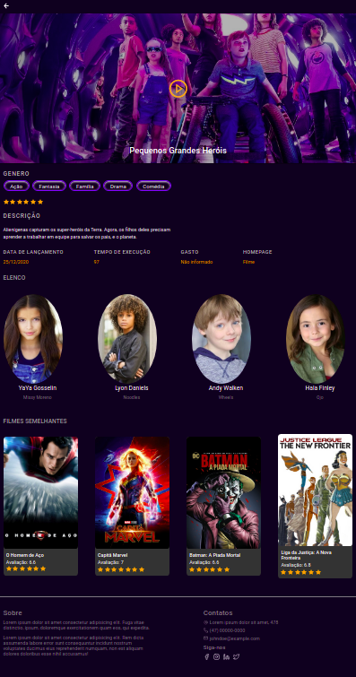
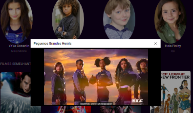

<h1 align="center">
 React Movies
</h1>

<p align="center">
  <a href="#%EF%B8%8F-Sobre-o-projeto">Sobre o projeto</a>&nbsp;&nbsp;&nbsp;|&nbsp;&nbsp;&nbsp;
  <a href="#-Tecnologias">Tecnologias</a>&nbsp;&nbsp;&nbsp;|&nbsp;&nbsp;&nbsp;
  <a href="#-Começando">Começando</a>&nbsp;&nbsp;&nbsp;|&nbsp;&nbsp;&nbsp;
  <a href="#-license">License</a>
</p>

## Layout

Home
<div align="center">
 
</div>

Info
<div align="center">
 
</div>

Video
<div align="center">
 
</div>

## 💇🏻‍♂️ Sobre o projeto

Este projeto foi criado atravez de um test para front-endusando a api TMDB de filmes.

## 🚀 Tecnologias

- [ReactJS](https://reactjs.org/)
- [TypeScript](https://www.typescriptlang.org/)
- [React Icons](https://react-icons.netlify.com/#/)
- [Styled Components](https://styled-components.com/)
- [Axios](https://github.com/axios/axios)
- [Eslint](https://eslint.org/)
- [Prettier](https://prettier.io/)
- [EditorConfig](https://editorconfig.org/)

## 💻 Començando

### Requisitos

**crie uma conta na (TMDB)[https://www.themoviedb.org/documentation/api] para criar uma Key de  acesso**

```bash
$ git clone git@github.com:mauriciogirardi/react-movie.git
```

**Follow the steps below**

```bash
# instale as dependencias
$ yarn

# .env
crie um .env e copie o conteudo do .env.example e coloque a Key da api (TMDB)[https://www.themoviedb.org/documentation/api]

# Start the client
$ yarn start
```

## 📝 License

This project is licensed under the MIT License - see the [LICENSE](LICENSE) file for details.

---

Made with 💜 by Mauricio Girardi 👋 [See my linkedin](https://www.linkedin.com/in/mauricio-girardi/)
